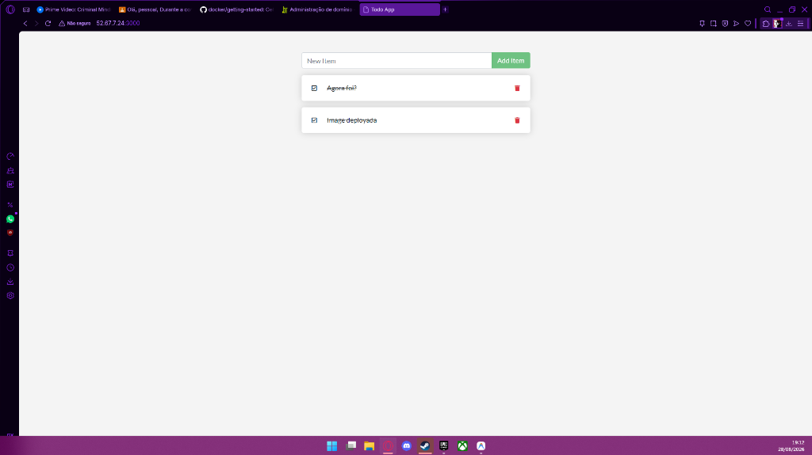
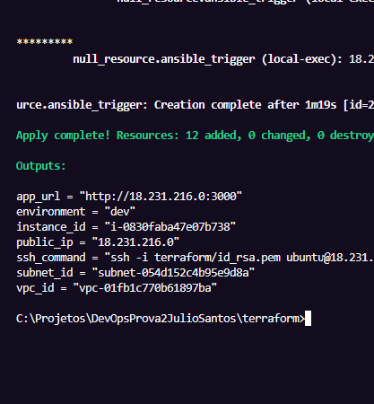
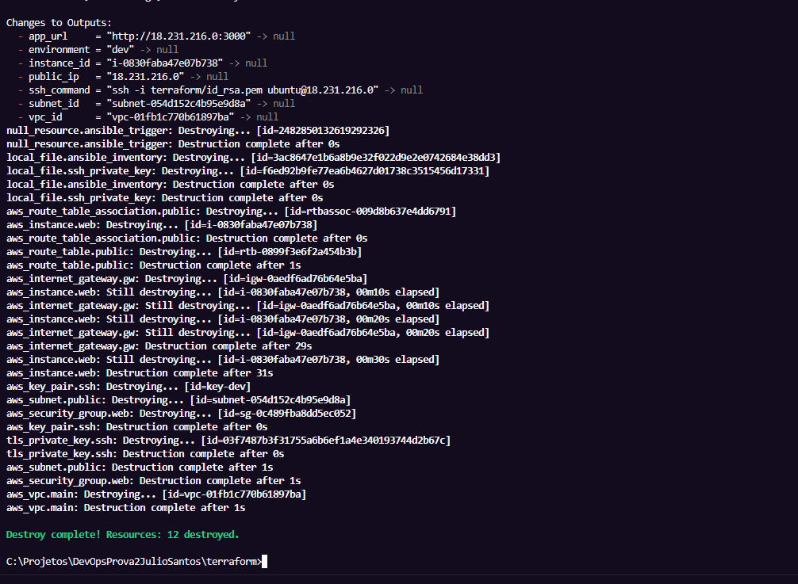

# Prova Avaliativa 2: Provisionamento e Configuração Integrados (Terraform + Ansible)

Este repositório foi desenvolvido para a entrega da **Prova Avaliativa 2** da disciplina de **Infraestrutura como Código**. 

O objetivo do projeto é fazer o Terraform e o Ansible trabalharem juntos em um fluxo automatizado. O Terraform cria toda a parte de rede e máquina na AWS e, logo em seguida, o Ansible instala o Docker e sobe o container do `getting-started-app` (porta 3000) de forma automática e sem comandos manuais.

---

## 1. Como a arquitetura foi desenhada

O fluxo de infraestrutura e o processo de integração entre o Terraform e o Ansible funcionam assim:

```
Internet
   │
   ▼
[ Internet Gateway ]
   │
   ▼
VPC (Ambiente dev: 10.0.0.0/16 | Ambiente prod: 10.1.0.0/16)
   │
   ▼
Subnet Pública (Ambiente dev: 10.0.1.0/24 | Ambiente prod: 10.1.1.0/24)
   │
   ▼
Security Group (Liberando portas: 22 [SSH] e 3000 [Web App])
   │
   ▼
┌──────────────────────────────────────┐
│  Máquina EC2 (t3.micro)              │ ◄── Provisionada pelo Terraform
├──────────────────────────────────────┤
│  - Docker Engine                     │ ◄── Instalado pelo Ansible
│  - Container: getting-started-app    │ ◄── Rodando via Ansible (community.docker)
│    (Porta do host 3000 -> container 80)
└──────────────────────────────────────┘
   ▲
   │ (Fluxo de automação)
   │
[ terraform apply ] ──► [ local-exec ] ──► [ Gerar hosts.ini ] ──► [ Rodar Playbook (WSL) ]
```

---

## 2. Como foi feita a integração (Terraform → Ansible)

Para integrar as duas ferramentas sem usar o anti-padrão `remote-exec`, escolhi a **Opção B (local-exec disparando o Ansible automaticamente)**. Como estou usando o Windows com o Ansible instalado no WSL (Debian), configurei o Terraform para fazer a ponte entre os dois ambientes:

1. **Chave SSH**: O próprio Terraform gera uma chave privada RSA (`tls_private_key.ssh`), cadastra a chave pública correspondente na AWS (`aws_key_pair.ssh`) e salva a chave privada na minha máquina como `terraform/id_rsa.pem`.
2. **Geração do Inventário**: Quando a máquina é criada, o Terraform gera dinamicamente o arquivo `ansible/hosts.ini` com o IP público da máquina.
3. **Trigger de Automação (`local-exec` no PowerShell)**:
   - Criei um `null_resource.ansible_trigger` que roda comandos PowerShell no Windows após o deploy do servidor.
   - Ele fica fazendo um loop testando a conexão TCP na porta `22` (SSH) da máquina criada até ela responder (garantindo que o servidor já terminou de ligar).
   - Assim que o SSH está pronto, o script cria a pasta `/home/Shura/.ssh` no WSL, copia a chave gerada e a senha do vault (`vault_pass.txt`) com permissão segura `600` para evitar erros de segurança do SSH e do Ansible.
   - Por fim, executa o `ansible-playbook` chamando o interpretador do WSL de forma totalmente automatizada.

---

## 3. Playbooks e Boas Práticas do Ansible

- **Idempotência e Construção Local**: Não utilizei blocos `shell` ou `command` para clonar o repositório, gerar o Dockerfile ou subir o container. O Ansible instala o `git`, clona o repositório oficial da aplicação (`https://github.com/docker/getting-started-app`), cria dinamicamente o `Dockerfile` com Node.js na pasta de destino, e constrói a imagem localmente na máquina usando o módulo `community.docker.docker_image`. O container é executado e gerenciado de forma idempotente pelo módulo `community.docker.docker_container`.
- **Ansible Vault**: A variável sensível fictícia `vault_app_admin_password` foi definida no arquivo `ansible/group_vars/all/vault.yml` e está devidamente criptografada. O arquivo `ansible/vault_pass.txt` (adicionado ao `.gitignore`) fornece a senha de descriptografia automaticamente durante o provisionamento.

---

## 4. Como testar o projeto

### Pré-requisitos
- Terraform instalado no Windows.
- Credenciais da AWS configuradas no terminal.
- WSL (Debian/Ubuntu) rodando no Windows com Ansible instalado.

### Passo a passo para rodar:
1. Abra a pasta do Terraform e inicialize os providers:
   ```powershell
   cd terraform
   terraform init
   ```
2. Crie ou selecione o workspace (ex: `dev` ou `prod`):
   ```powershell
   terraform workspace new dev
   terraform workspace select dev
   ```
3. Suba toda a infraestrutura e a aplicação de uma vez só:
   ```powershell
   terraform apply -auto-approve
   ```
4. Para acessar, basta usar a URL gerada no output (`app_url`).

### Como limpar tudo:
Para remover todas as máquinas e redes criadas na AWS e não gerar custos, rode:
```powershell
terraform destroy -auto-approve
```

---

## 5. Evidências de que deu tudo Certo (Prints)

Adicionei os prints das execuções que fiz no ambiente de desenvolvimento:

### 1. Aplicação no Navegador (Acessando o IP público na porta 3000)
Aqui está a tela do site oficial do Docker subindo com sucesso na nossa instância:



### 2. Terminal após o `terraform apply` com sucesso
O print mostra o final da execução, onde o Ansible rodou com sucesso por dentro do local-exec e mostrou os outputs de IP e URL:



### 3. Terminal após o `terraform destroy`
Mostra que toda a infraestrutura (máquinas, redes, rotas, etc.) foi apagada da minha conta AWS sem sobrar nada:


